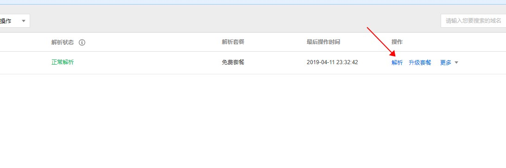
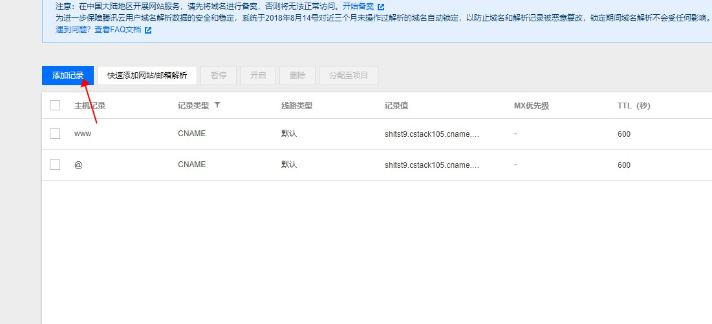
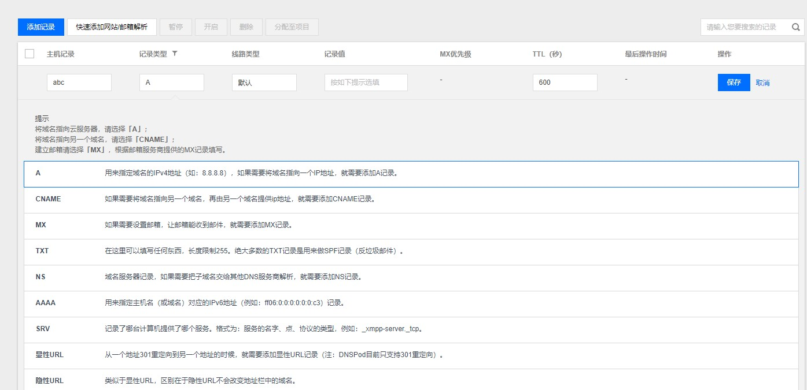

# 项目部署之测试服和正式服的注意事项
> 目的：为了保证用户在项目__正式运营__中不受我们开发的影响
  
## 项目开发主要流程如下
> 开发程序阶段统一用**测试服**，当测试没问题才能同步到**正式服**，不能同步测试服数据库数据到正式服数据库
1. 产品经理收集需求，并确认原型
2. 原型确认后，开始评审
3. 评审后开始设计UI
4. UI确认后，开始开发
    - __前端开发__ --> *测试服*
    - __后端开发__ --> *测试服*
5. 开发完成后，开始测试
6. 测试完成后交付客户测试，客户使用培训，项目上线 --> __正式服__
7. 发现项目Bug或者需其新增时, 流程如下: 
    1. 根据需求，修改程序 --> __测试服__
    2. 测试程序
    3. __测试通过后，重新上线__ --> __正式服__
  
## 项目开发时域名的使用
1. 项目开发所使用的**域名**统一写到配置文件，然后使用域名时引入配置文件中的域名，方便以后切换修改
2. 项目开发阶段，前后端使用的域名为__测试域名__，服务器也是__测试服__
3. 开发完成通过测试后
    - 通过测试后
        + 将测试服上程序和数据库复制一份到正式服，然后清空正式服上数据库的测试数据
        + 将正式服域名指向正式服，然后将正式服代码和正式服的数据库连接好
        + 确认正式服项目可以正常使用，然后交付客户
    - 交付后需要修改
        + 先在测试服上修改，
        + 改完之后测试，
        + 通过测试后，同步测试服修改了的代码文件到正式服，
        + 如果修改了数据库结构，需要同步数据库结构，**但是不能同步数据库数据**
    - 如果APP项目/小程序项目修改后，为了过审核而需要特殊处理
        + 先准备个审核域名如examine.com，然后这个域名指向测试服务器
        + 前端和后台都使用这个域名作为接口的域名，并在测试服务器中返回屏蔽某些功能的数据
        + 然后提交审核，比如（Appstore）(微信)
        + 当通过审核后，重新解析审核域名examine.com，让examine.com指向正式服，相应的后台代码也需要同步到正式服，并开放之前封闭的功能
        + 完成切换
  
## 服务器、IP地址和域名的关系
    - 服务器： 服务器就像一台加强的家用电脑，后端程序和数据库运行在服务器上
    - IP地址： 全称互联网协议地址，一个网卡可以绑定一个ip地址，一般一个服务器对应一个ip，通过ip可以访问服务器
    - 域名： 就是ip地址的别名，通过DNS，我们访问域名就会自动访问域名所对应的ip地址上的服务器
    - 也就是说，上网打开www.baidu.com, 就是访问ip: 14.215.177.39, 也就是访问这个ip对应的服务器
  
## 如何解析域名 (更换域名指向的服务器)
1. 首先登录对应域名提供商控制台，如阿里云，腾讯云
2. 寻找域名解析的功能，然后点击解析，然后添加或修改记录，按提示填入即可完成修改
3. 如下图腾讯云所示：

